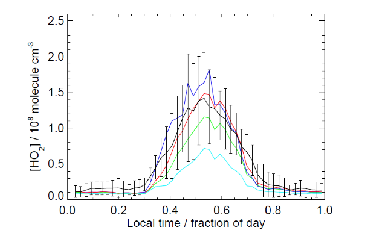
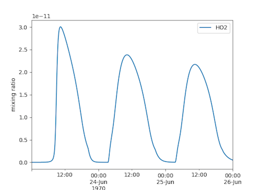
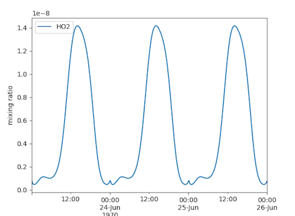

# Soft Constraining a Species Concentration to Observation. 

##### In this guide we shall approximate a diurnal equation using a 
function, and then include this in the constraints array of DSMACC

Note: the dim of the curve fit need to be adjusted, as does the 
pressision of the fitting. This will be done in future automatically, 
but until then this should serve as a guide. (high dim corresponds to 
more calculations,and thus a slower running model). As dims are by 
default, xlength-1, do not supply more than 10 day fraction values. 

Program: Julia - although python or any other curve fitting program may 
be used. 


### Firstly we need some observations 

To do this I shall use a HO2 diurnal taken from the Thesis of Peter M. 
Edwards - Tropospheric oxidation from the Tropics to the Poles, Leeds 
2011. 





I shall use readings every 0.1 fraction/day from the Black line. These 
are out trial concentrations for the method, so the actual values do not 
matter.  


```julia
# To get a fit for the observations I use Julia as it seems the easiest 
method
# Include libraries (install with Pkg.add("libraryname"))
using Polynomials
using UnicodePlots

```


```julia
species = "HO2"
observations = [8e-10,1e-9,1e-9,2e-9,8e-9,1.4e-8,1.3e-8,7e-9,1e-9,9e-10]
hours  = linspace(0,1,length(observations)) #fract day 


#curve of observations
#length = len(x) -1 - change this or do not use > 10 observation points 
-> smoothing
fit = polyfit(hours,[log10(x) for x in observations])
print(fit)


#Since this will be run in a terminal we can use unicode plotting to 
check that we are not overfitting. 
xaxis = linspace(0,1,100)
ypred = [(10^fit(x))/1e-8 for x in xaxis] #divided by 1e-8 to get rid of 
the log axis requirement as per original plot


#plotting
myplot = lineplot(xaxis,ypred, title = species, name = "Prediction",  
color=:blue,border=:bold)
myplot = scatterplot!(myplot, hours, [i/1.e-8 for i in observations], 
name = "Observations",color=:magenta)

println(myplot)
```

    Poly(-9.136910012988708 - 19.043869223495985*x + 
481.4511050554504*x^2 - 4471.672275544299*x^3 + 20929.295613210943*x^4 - 
55026.76874840524*x^5 + 85141.43766292353*x^6 - 77002.83860070464*x^7 + 
37641.488066733735*x^8 - 7673.297801523576*x^9)[1m[0m €37mâ €mmmmâ €[37mâ €        
    E model_Global,       ONLY: CONSTRAIN,CFACTOR\n\n"
h_fract = "DFRACT = mod(((DAYCOUNTER*dt)/86400.) + mod(JDAY,1.),1.)\n"

eq1 = "C(ind_$(species))= CFACTOR*(10**($(s_eq)))"
eq2 = "CONSTRAIN(ind_$(species)) = C(ind_$(species))"

println(use * h_fract * "\n" *eq1 * "\n" * eq2)
```

    USE model_Global,       ONLY: CONSTRAIN,CFACTOR
    
    DFRACT = mod(((DAYCOUNTER*dt)/86400.) + mod(JDAY,1.),1.)
    
    C(ind_HO2)= CFACTOR*(10**(-9.0969 - 19.0438*DFRACT &
    	+ 481.4511*DFRACT**2 - 4471.6722*DFRACT**3 &
    	+ 20929.2956*DFRACT**4 - 55026.7687*DFRACT**5 &
    	+ 85141.4376*DFRACT**6 - 77002.8386*DFRACT**7 &
    	+ 37641.4880*DFRACT**8 - 7673.2978*DFRACT**9))
    CONSTRAIN(ind_HO2) = C(ind_HO2)


## Results:

Below are the results as a proof of concept. If you just want to vary 
temp, You may import the variable using 

            USE model_Global,       ONLY: CONSTRAIN,CFACTOR,TEMP
            
replace C(ind_HO2) with TEMP and ommit the line CONSTRAIN(ind_HO2) = 
C(ind_HO2).


#### Pre constraing - HO2 is used up over time
  

#### After constraining all peaks are identical and match our "observed" 
values



